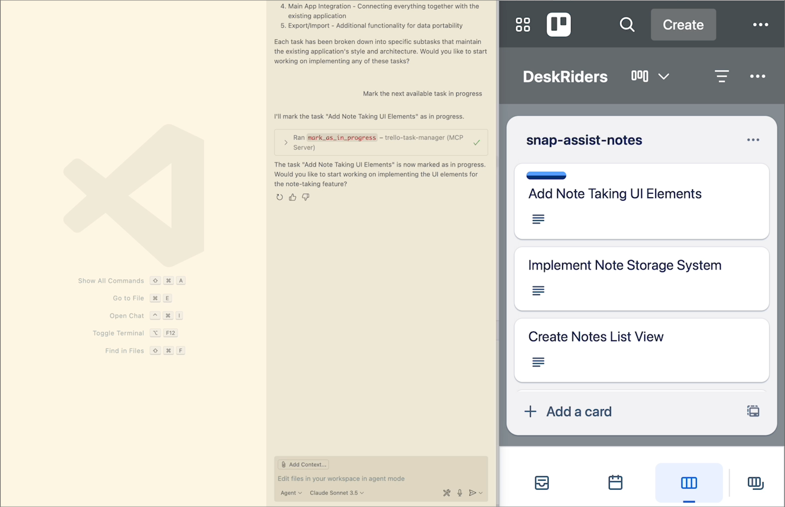

# Trello Task Manager MCP

LLM Task management System that integrates as an MCP Server and uses Trello for managing tasks/cards.



## Features

- Create and manage tasks in Trello boards
- Mark tasks as in-progress or completed
- Get next available task
- Get filtered list of tasks (all, work-in-progress, or completed)
- Add and manage checklists for tasks
- Get next unchecked checklist item for focused work

## Prerequisites

- Python 3.10 or higher
- [uv](https://github.com/astral-sh/uv)
- A Trello account with [API Key and Token](https://trello.com/power-ups/admin)

## Installation

1. Clone the repository:

   ```bash
   git clone https://github.com/namuan/trello-task-manager-mcp.git
   cd trello-task-manager-mcp
   ```

2. Install dependencies:

   ```bash
   uv sync
   ```

3. Create a `.env` file in the project root with your Trello credentials:

   ```env
   TRELLO_API_KEY=your_api_key
   TRELLO_API_TOKEN=your_api_token
   TRELLO_BOARD_NAME=your_board_name
   HOST=127.0.0.1  # Optional, defaults to 127.0.0.1
   PORT=8050      # Optional, defaults to 8050
   ```

4. Run the application

   ```bash
   trello-task-manager-mcp
   ```

   or

   ```bash
   make run
   ```

## MCP Integration

Add the following entry to your MCP client:

```json
{
  "mcpServers": {
    "trello-task-manager": {
      "type": "sse",
      "url": "http://localhost:8050/sse",
      "note": "For SSE connections, add this URL directly in your MCP Client"
    }
  }
}
```

## Usage

Ask MCP Client to use `Trello task manager` along with the instructions to use one of these tools.

- `add_task`: Create a new task
- `get_next_available_task`: Get the next available task
- `get_tasks`: Get a list of tasks with optional filtering (all, wip, done)
- `mark_as_in_progress`: Mark a task as in progress
- `mark_as_completed`: Mark a task as completed
- `update_task_with_checklist`: Add or update a checklist for a task
- `complete_checklist_item`: Mark a specific checklist item as completed
- `get_next_unchecked_checklist_item`: Get the next unchecked checklist item for a task

## Development

### Setup Development Environment

This project uses `uv` for dependency management. Run the following command to set up your development environment:

```bash
make install
```

This will:

- Create a virtual environment using uv
- Install project dependencies
- Set up pre-commit hooks

### Development Commands

The project includes several helpful make commands:

```bash
make help     # Show all available commands with descriptions
make check    # Run code quality tools (lock file check and pre-commit)
make run      # Run the application
make build    # Build wheel file
```

## License

This project is licensed under the MIT License - see the [LICENSE](LICENSE) file for details.
